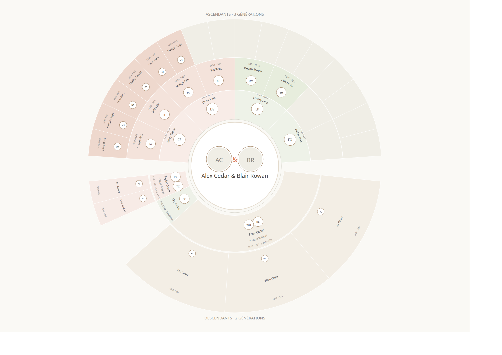

# Two-Way Fan Chart for Gramps

A stable graphical-report add-on for **Gramps 6.0.x**. It renders a central couple, ancestors above, descendants below, and privacy-safe portrait medallions in a publication-ready fan chart.

## Screenshot



*Publication preset with entirely synthetic names and relationships. No real genealogy or portrait is shown.*

## Install as a Gramps add-on project

The repository is directly consumable by the Gramps Addon Manager and supports automatic update discovery.

1. Open the **Addon Manager** in Gramps.
2. In **Configuration → Projects**, add a project named `grostim` with this URL:

   ```text
   https://raw.githubusercontent.com/grostim/gramps-two-way-fan-chart/main/gramps60
   ```

3. Return to **Extensions**, refresh the list, select **Two-Way Fan Chart**, and install it.
4. Restart Gramps if requested.

The project exposes the files expected by Gramps:

- `gramps60/listings/addons-en.json`
- `gramps60/listings/addons-fr.json`
- `gramps60/download/TwoWayFanChart.addon.tgz`

### Installation rapide en français

Dans le gestionnaire d’extensions Gramps, ajoutez le projet `grostim` avec l’URL ci-dessus, actualisez la liste, puis installez **Éventail généalogique bidirectionnel** depuis l’onglet **Extensions**.

## Manual installation

Download `TwoWayFanChart.addon.tgz` from the [latest GitHub release](https://github.com/grostim/gramps-two-way-fan-chart/releases/latest), then use **Addon Manager → Extensions → Install from file**.

## Usage

1. Open a Gramps family tree.
2. Go to **Reports → Graphical Reports → Two-Way Fan Chart**.
3. Select the center family and the desired privacy/layout preset.
4. Choose SVG, PDF, or PNG output and generate the report.

Headless example:

```bash
gramps -O "MyTree" -a report -p \
  name=two_way_fan_chart,off=svg,of=fan-chart.svg,center_family=F0001
```

## Features

- bidirectional ancestor/descendant fan layout;
- call-name-first publication labels;
- privacy filtering before formatting and media loading;
- circular portrait crops with neutral, gendered, or initials fallbacks;
- weighted descendant sectors and narrow-sector radial labels;
- standalone SVG output without network resources or JavaScript;
- optional PDF and PNG output through Cairo;
- GUI and headless CLI support.

## Privacy

Publication mode masks living/private people before names, facts, portraits, metadata, and diagnostics reach the renderer. Masked people use neutral visual markers; their source media is not loaded.

No real genealogy database, family portrait, or generated chart based on private data is included in this public repository. The screenshot above was generated exclusively from synthetic fixtures.

## Compatibility

- Gramps: **6.0.x**
- Add-on version: **1.1.0**
- SVG: no optional dependency
- PDF/PNG: Cairo/Pango support required in the Gramps runtime

## Repository contents

- `TwoWayFanChart/` — distributable add-on source
- `gramps60/` — Gramps project listings and installable archive
- `build_addon.py` — distribution builder

## License

GPL-3.0-or-later. See [`LICENSE`](LICENSE).
