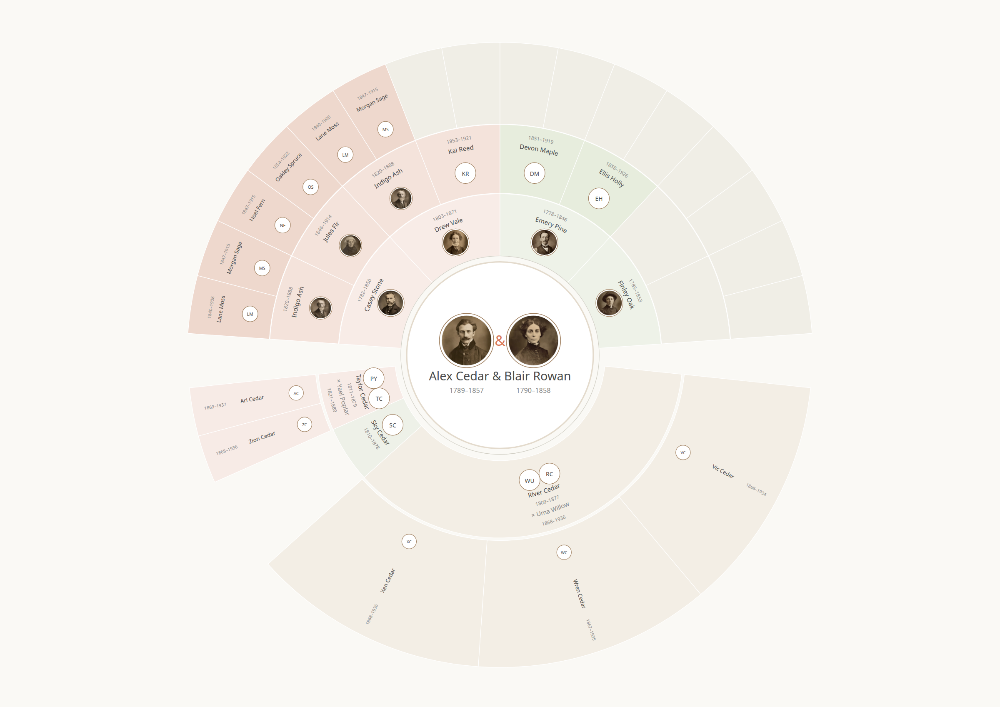

# Two-Way Fan Chart for Gramps

A stable graphical-report add-on for **Gramps 6.0.x**. It renders a central couple, ancestors above, descendants below, and privacy-safe portrait medallions in a publication-ready fan chart.

## Screenshot



*Publication preset with entirely synthetic names and relationships. The vintage portraits are AI-generated fictional identities; no real genealogy or person is shown.*

## Install as a Gramps add-on project

The repository is directly consumable by the Gramps Addon Manager and supports automatic update discovery.

1. Open the **Addon Manager** in Gramps.
2. In **Configuration → Projects**, add a project named `grostim` with this URL:

   ```text
   https://raw.githubusercontent.com/grostim/gramps-two-way-fan-chart/main/gramps60
   ```

3. Return to **Extensions**, refresh the list, select **Two-Way Fan Chart**, and install it.
4. Restart Gramps if requested.

The project exposes the files expected by Gramps:

- `gramps60/listings/addons-en.json`
- `gramps60/listings/addons-fr.json`
- `gramps60/download/TwoWayFanChart.addon.tgz`

### Installation rapide en français

Dans le gestionnaire d’extensions Gramps, ajoutez le projet `grostim` avec l’URL ci-dessus, actualisez la liste, puis installez **Éventail généalogique bidirectionnel** depuis l’onglet **Extensions**.

## Manual installation

Download `TwoWayFanChart.addon.tgz` from the [latest GitHub release](https://github.com/grostim/gramps-two-way-fan-chart/releases/latest), then use **Addon Manager → Extensions → Install from file**.

## Release and Gramps Web deployment

Every successful `push` to `main`—including a merged pull request—runs the
following gates in order:

1. test and compile the add-on;
2. rebuild and validate the committed Gramps distribution;
3. create the GitHub release `vX.Y.Z` with `TwoWayFanChart.addon.tgz` and its
   SHA-256 checksum.

The pull request supplies the version. A release PR must update the version in
`build_addon.py` and `TwoWayFanChart/TwoWayFanChart.gpr.py`, then regenerate the
archive and both listings with `python3 build_addon.py`. Reusing an existing
version is rejected rather than replacing an existing tag or release.

The optional `deploy / GrampsWeb` job is skipped unless the repository variable
`GRAMPSWEB_DEPLOY_ENABLED` is exactly `true`. To enable it:

1. merge the matching `portainer-util` change that adds the
   `grampsweb_addon` downloader service and its persistent add-on mount;
2. configure the repository secret `PORTAINER_UTIL_TOKEN` with a fine-grained
   token limited to **Contents: read/write** on `grostim/portainer-util`;
3. set the repository variable `GRAMPSWEB_DEPLOY_ENABLED=true`;
4. keep the Portainer stack connected to `grostim/portainer-util` on `main` with
   its existing push webhook.

The deployment job commits only the two validated rollout markers to
`portainer-util`. Portainer then runs the downloader, which retrieves the exact
GitHub release asset, verifies its checksum, stages it outside the plugin scan
root, and promotes it atomically. The web and Celery services share the
read-only add-on mount and are recreated by the semantic rollout marker.

No SSH key or GrampsWeb credential is stored in this repository. Keep
`PORTAINER_UTIL_TOKEN` in GitHub Actions secrets only.

## Usage

1. Open a Gramps family tree.
2. Go to **Reports → Graphical Reports → Two-Way Fan Chart**.
3. Select the center family and the desired privacy/layout preset.
4. If tag markers are useful for a working chart, enable **Show citation
   markers** and enter a Gramps tag in **Highlight tag**. The publication
   profile leaves this option disabled so the fan remains visually uncluttered;
   the signal is cleared automatically for masked or excluded people.
5. Choose SVG, PDF, or PNG output and generate the report.

To include marriage information for each recorded ancestor couple, enable
**Show ancestor marriages**. The report then inserts compact intermediate
sectors in the ancestor fan and displays the recorded marriage year and place.
The option is disabled by default and does not alter the standard fan layout.

To include the same information for descendant couples, enable
**Show descendant marriages**. Intermediate sectors are inserted after each
descendant generation; when a distant sector cannot carry the place legibly,
the label keeps the marriage year only. This option is also disabled by default.

Headless example:

```bash
gramps -O "MyTree" -a report -p \
  name=two_way_fan_chart,off=svg,of=fan-chart.svg,center_family=F0001
```

## Features

- bidirectional ancestor/descendant fan layout;
- adaptive ancestor depth from 0 to 8 generations, with density-aware detail reduction;
- complete given-name + surname labels for the center and ancestors, with usage-name labels for descendants; records without known life years have no date label;
- optional intermediate ancestor-marriage sectors with marriage year and place;
- optional intermediate descendant-marriage sectors with year/place fallback;
- privacy filtering before formatting and media loading;
- optional exact-name tag highlighting with a grayscale-distinct marker;
- circular portrait crops with neutral, gendered, or initials fallbacks;
- weighted descendant sectors and narrow-sector radial labels;
- portable vector labels for SVG, librsvg/Cairo, and browser renderers;
- standalone SVG output without network resources or JavaScript;
- optional PDF and PNG output through Cairo;
- GUI and headless CLI support.

## Privacy

By default, the chart includes all individuals, including private and living people, as requested for family use. The **Safe publication** privacy mode remains available when an export must mask living/private people before names, facts, portraits, metadata, and diagnostics reach the renderer. Masked people use neutral visual markers; their source media is not loaded.

No real genealogy database, family portrait, or generated chart based on private data is included in this public repository. The screenshot above was generated exclusively from synthetic fixtures and AI-generated fictional portraits.

## Compatibility

- Gramps: **6.0.x**
- Add-on version: **1.2.44**
- SVG: no optional dependency
- PDF/PNG: Cairo/Pango support required in the Gramps runtime

## Repository contents

- `TwoWayFanChart/` — distributable add-on source
- `gramps60/` — Gramps project listings and installable archive
- `build_addon.py` — distribution builder

## License

GPL-3.0-or-later. See [`LICENSE`](LICENSE).
